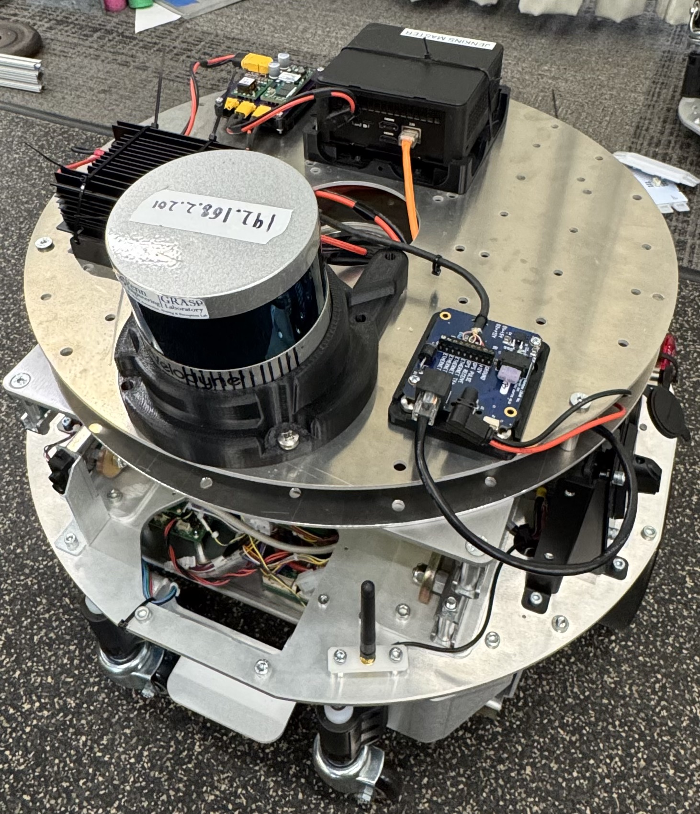
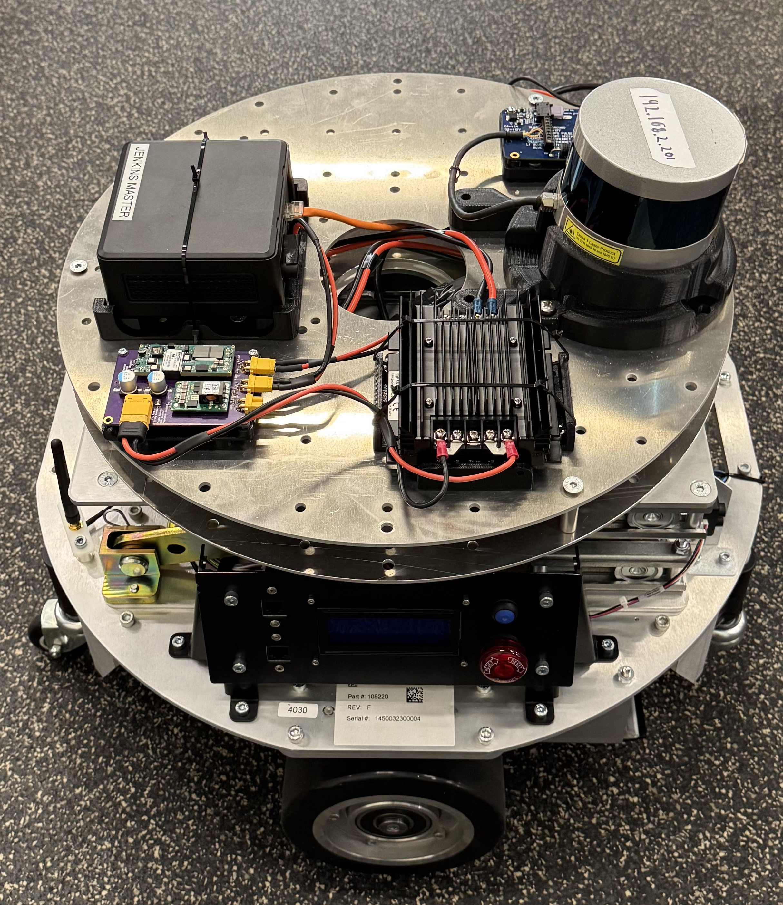
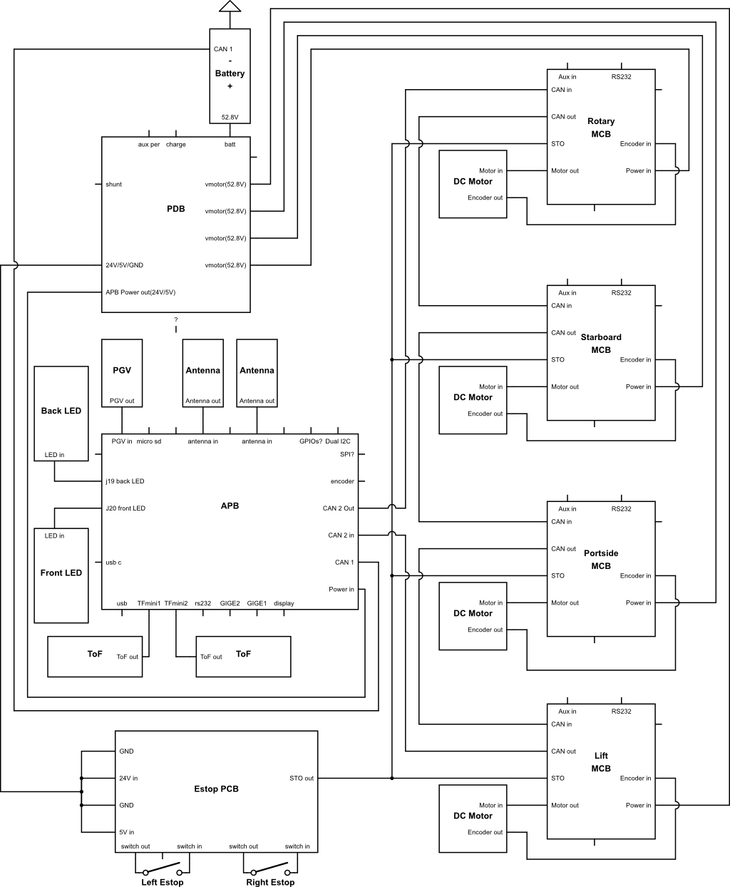
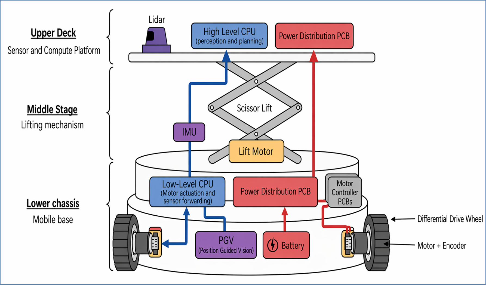
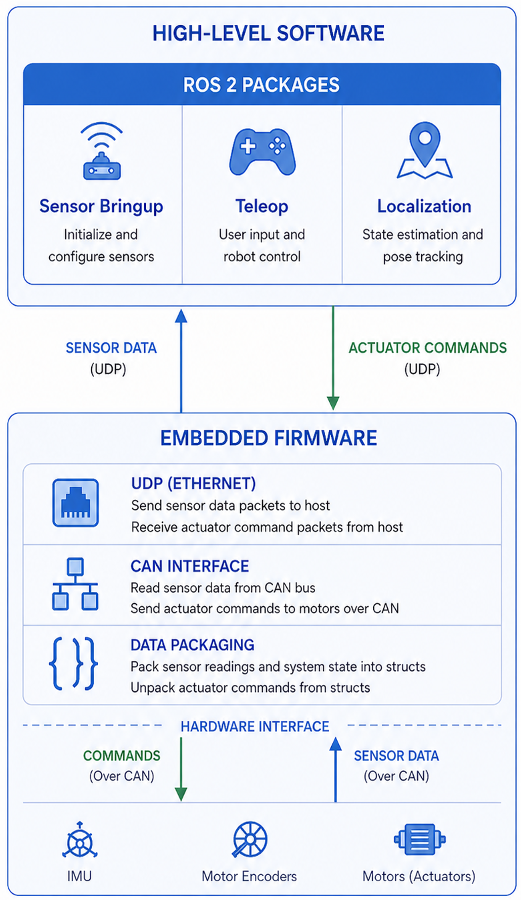
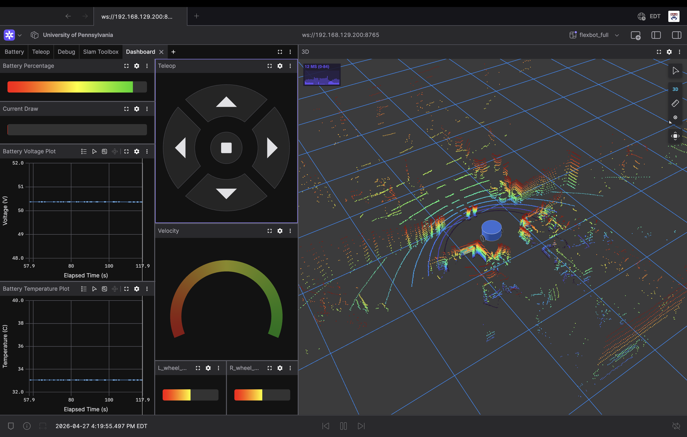

# FlexBot Reverse Engineering and ROS Integration

## Overview

Berkshire Grey dropped off 30 differential drive industrial robots known as FlexBots to the University of Pennsylvania. The goal of this capstone project was to reverse engineer the FlexBot and repurpose it to be used for future research projects at Penn. I started by disassembling the robot, documenting all its components, and mapping out all the electrical connections. Next, I connected to the onboard computer and evaluated the robot's custom control software. Once I gained control of the motors and was able to read the data from the sensors, I removed the top rotary stage and mounted a LIDAR and external computer. Finally, I integrated the whole system into ROS to enable teleoperation, odometry, and SLAM.

  
  

---

## Hardware

After disassembling the robot I separated the components into 3 subsections: The Mobile Base, Scissor Lift Stage, and Rotary Stage. Below is a quick description of each stage, but please refer to this [Miro Board](https://miro.com/app/board/uXjVJ2xI5w8=/) for the full hardware documentation.

### Mobile Base

The mobile base is the main working platform of the robot and contains most of the important systems. Two drive motors allow the robot to move around, while the onboard electronics control power distribution, computation, and sensing. The base contains components such as the Motor Control Boards (MCBs), Power Distribution Board (PDB), sensors, LEDs, WiFi antennas, and the main compute board (APB). These systems work together to help the robot operate autonomously, process sensor data, and communicate with other systems.

### Scissor Lift Stage

The scissor lift stage sits on top of the Mobile Base and gives the robot vertical movement by raising and lowering the top platform. It uses a scissor lift mechanism powered by the lift motor to extend upward when needed. It also contains a wire management channel to route cables from the mobile base to the rotary stage without getting pinched.

### Rotary Stage

The rotary stage was originally included to allow the top section of the robot to rotate independently from the base. It used a rotary motor and rotating platform mechanism to provide smooth turning motion for sensors or attachments mounted on top. This stage is present on the original flexbots donated to Penn, but for this project has been removed and power for the rotary motor has been diverted to the external computer and LIDAR.

---

## Electrical Connections

The diagram below shows the overall electrical layout of the robot and how the different PCBs connect to each other. Rather than labeling every individual wire within each cable, the diagram focuses on the main connectors and subsystem relationships to keep the system architecture easier to understand.

  
   
  <b>Figure 1: Circuit Diagram of Flexbot’s Internal Electronics</b>

---

## Software Analysis

To gain control over the FlexBot's internal systems, I began by establishing direct serial communication with the onboard CPU. This connection allowed me to monitor the boot sequence and understand the base operating system environment. I found that the CPU automatically tried connecting to a WiFi network called `bg-flexbot-wifi6`, so I spoofed the expected network to gain SSH access to the internal filesystem.

Next, gaining control of the motors required reverse engineering the internal CAN network which I did with the help of Kartik Virmani of [MOD lab](https://www.modlabupenn.org/). By using the robot's built-in maintenance program to send known movement commands, we monitored the resulting CAN traffic. By matching the data packets to specific inputs, we mapped out the CAN IDs for motor velocities and sensor data, ultimately allowing us to write custom control scripts that bypassed the original software entirely.

All code developed for the low level computer onboard the Flexbot can be found in [this branch](https://github.com/etsa2103/flexbot_capstone/tree/low_level_cpu) of the project Github. It also contains a clear README with everything you should need to replicate this setup on your own.

---

## Modifications

To repurpose the FlexBot for standard research applications, I made several hardware modifications to support external hardware integration.

First, to bypass restrictions imposed by the proprietary safety board, I disconnected the board and manually rerouted 24V power to each of the Safety Torque Off (STO) pins on the Motor Control Boards (MCBs). This 24V supply was sourced from the Power Distribution Board (PDB) and routed through both Emergency Stop (E-stop) buttons, preserving a functional hardware safety mechanism during operation.

Next, I collaborated with Jaimes Romero to remove the original rotary stage and replace it with a custom-fabricated top plate, creating a stable and flat mounting surface for new hardware. We also designed and 3D-printed custom mounts for a VLP-16 LIDAR, external high-level computer, and power distribution components. The CAD files for these mounts can be found [here](CAD). To power the new components, we tapped directly into the robot’s PDB and routed the required voltages to the top plate assembly.

The resulting hardware architecture is summarized in the figure below, while additional documentation can be found in the modified hardware section of the [Miro Board](https://miro.com/app/board/uXjVJ2xI5w8=/).

  
   
  <b>Figure 2: Hardware Breakdown of Modified FlexBot</b>

Finally, because the original system relied on proprietary Berkshire Grey charging docks that were unavailable to us, I sourced an external charger to safely recharge the batteries rather than developing a custom charging dock.

---

## ROS Integration

To integrate the FlexBot into ROS 2, I established a dedicated Ethernet connection between the robot's low-level embedded computer and the new external high-level CPU. The low-level system processes raw hardware telemetry and continuously streams it as UDP packets to the high-level computer. There, custom ROS 2 nodes capture this UDP data and publish it to standard ROS topics. This architecture powers a teleoperation package that translates manual inputs into safe motor commands while simultaneously calculating precise wheel odometry. By combining this odometry with data from the integrated VLP-16 LiDAR, the system successfully runs a 2D SLAM pipeline to generate real-time maps of its environment. The full software breakdown is summarized in the figure below.

  
   
  <b>Figure 3: Software Breakdown of Modified Flexbot</b>

Finally, all operational data, including the live map, sensor feeds, and hardware status, is streamed to a custom Foxglove Studio dashboard for comprehensive, real-time monitoring as shown below.

  
   
  <b>Figure 4: Foxglove Visualizer</b>

All code developed for the high level computer can be found in [this branch](https://github.com/etsa2103/flexbot_capstone/tree/high_level_cpu) of the project Github. It also contains a clear README with everything you should need to replicate this setup on your own.

---

## Side Notes and Next Steps

There are several remaining limitations and future improvements for the FlexBot platform. When charging the robot, it is important to ensure that the main power switch remains on, as the batteries will not charge otherwise. While the mobile base and LiDAR are fully operational, the scissor lift stage, LEDs, LCD display, PGV, and time of flight sensors are currently not fully integrated. The `low_level_cpu` branch has some scripts that attempt to access these parts of the hardware, but this control has not yet been exposed by a ROS node running on the high level cpu. Moving forward, the next major development goal is integrating a 3D SLAM pipeline to take advantage of the full capabilities of the mounted VLP-16 LiDAR. After reliable 3D mapping is achieved, future work will focus on implementing obstacle avoidance and autonomous exploration or mapping behaviors, allowing the FlexBot to operate with greater autonomy in research environments. Lastly, any additional documentation I collected along the way can be found in [this folder](additional_docs) of the repo.

---

## Acknowledgment

**Advisors:** I would like to thank Fernando Cladera and Dr. M. Ani Hsieh for their consistent advice and support throughout this project.

**Technical Contributors:** I would like to recognize Jaime Romero for all his CAD designs and his help during the debugging process. I would also like to recognize Kartik Virmani for much of the code he provided in this repo.

**Cornell University:** Thanks to Chris Bauer for providing the documentation and insights from his work on the robot during the previous semester.

## Appendix

- Kartik’s Github  
  https://github.com/virmani11kartik/bg_bot

- Kumar Robotic’s Github  
  https://github.com/KumarRobotics/kr_flexbot

- Miro Hardware Documentation  
  https://miro.com/app/board/uXjVJ2xI5w8=/

- Circuit diagram  
  https://www.circuitlab.com/circuit/pdmw4kpy644g/flexbot-circuit-diagram/

- Slack  
  https://app.slack.com/client/T09S1APBSHY/D09S4T6TL04